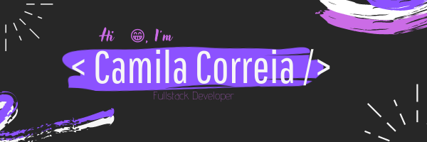

  

  
  
   

 

  

## Aspirante ^ 
Meu nome é <strong>Camila Correia</strong> tenho 20 anos e já possuo 6 anos de estudos em T.I, pois comecei a me interessar por essa área desde muito nova. Sou Fascinada por tecnologia, mais especificamente por programação e venho investindo muito em estudos para me tornar uma profissional da área.

Sou apaixonada em aprender coisas novas e conhecer novas culturas, por isso dedico meu tempo livre em estudar.

> My name is <strong>Camila Correia </strong> I am 20 years old and I have 6 years of studies in computer science, because from a very young age I started to be interested in this area. I'm fascinated by technology, specifically by programming and I've been investing a lot in studies to become a professional in the field.

> I am passionate about learning new things and learning about new cultures, so I dedicate my free time to studying.

## Minhas Paixões | My Passions

- Música | Music :headphones: 
- Programação | Programming :computer:
- Livros | Books :books:
- Estudar | To study :open_book:
- Café | Coffee :coffee:
- Halloween :jack_o_lantern:

#         
 

